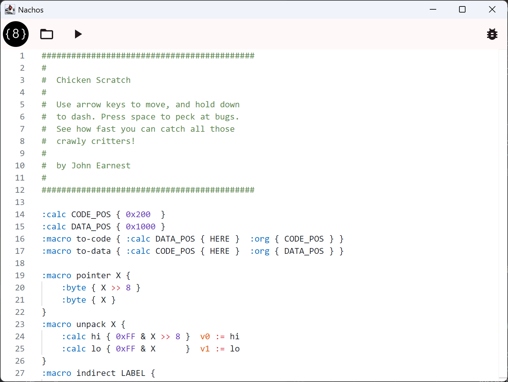
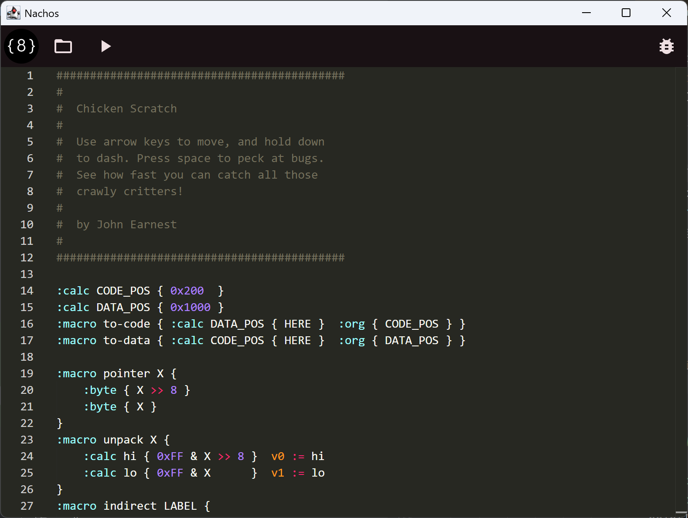

+++
title = "Chip8 IDE with Compose - Overview"
date = "2025-07-09"
description = "I'm building an IDE for Chip 8 using Compose Multiplatform."
tags = [
    "emulation",
    "kotlin",
    "compose",
    "programming",
]
+++

Video games were a large part of how I became interested in computing. The industry started in the 70s and expanded to include computer games as well as console gaming. By the late 90s when I was a teenager, these two worlds overlapped due to console emulation. Thanks to a 56k modem and a small amount of skill, I was introduced to the world of ROMs, Romhacks, Nesticle, Snes9x, and more. While these tools let me play so many pirated copies of games I couldn't afford on a child's salary, they also included tools that hinted at how they were written and how the consoles worked. Unfortunately, my skills at the time left me with the understanding that emulation was more "magic" than "advanced technology".

Even after college, I still didn't have a great grasp on how emulators worked. I understood the fundamentals from an academic sense, and eventually I discovered Chip8. Chip8 is an interpreted  instruction set developed by Joseph Weisbecker for the COSMAC VIP in the mid 70s. It is a very simple "machine" that has become a de facto "hello world" project for writing emulators. I wrote a Chip8 [emulator in Java](https://github.com/secondsun/chip8) in 2016 and turned the project into a series of lessons for developers to use to start building their own emulator using Test Driven Development practices.

In mid-2025, I was between jobs, giving me time to revisit the project. I had always meant to add more features to the emulator and implement community extensions like SuperChip, MegaChip, and XO-Chip. I found the [Octo](https://johnearnest.github.io/Octo/) project while researching these updates. It is a web-based IDE, dev tool, emulator, etc. for chip8 development. This inspired me to not just to add some features to my emulator, but start a similar project. Thus I started writing [Nachos](https://github.com/secondsun/nachos)

Nachos is a Desktop IDE written using Compose Multiplatform.  Eventually I plan on supporting Android and iOS tablets with a full set of features and integration. Currently I've integrated a theme system, the Monaco Editor, created a syntax highlighting theme, and ported my emulator from Java to Kotlin. Right now I'm working on implementing an Octo assembler and will share details of that later.



  <figure style="border: 1px solid #ccc; padding: 10px; text-align: center;">
    
    <figcaption>Nachos light mode</figcaption>
  </figure>

  <figure style="border: 1px solid #ccc; padding: 10px; text-align: center;">
    
    <figcaption>Nachos dark mode</figcaption>
  </figure>



# Citations
 * [Chip-8 on Wikipedia](https://en.wikipedia.org/wiki/CHIP-8)
 * [Octo](https://johnearnest.github.io/Octo/)
 * [CHIP-8 extensions and compatibility](https://chip-8.github.io/extensions/)